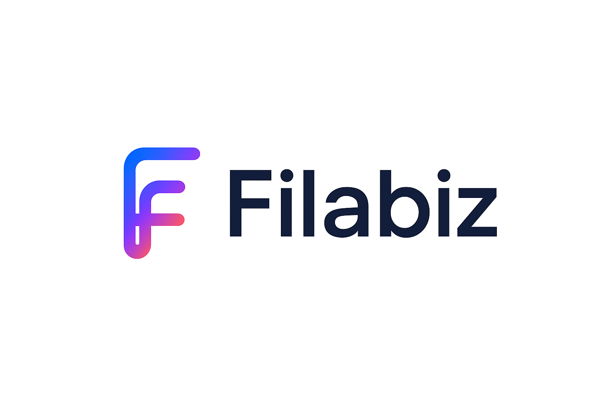

# Filabiz

## 🌐 Visão Geral

O **Filabiz** é uma plataforma moderna de gestão empresarial construída sobre o sólido framework **Apache OFBiz**.  
Nosso objetivo é trazer a robustez de um ERP modular de código aberto para um contexto **mais flexível, intuitivo e contemporâneo**, reduzindo a curva de aprendizado e acelerando a adoção em projetos de negócios digitais.

---

## 🚀 Motivações

1. **Complexidade do Apache OFBiz**  
   - Embora extremamente poderoso, o **OFBiz** pode ser intimidador para novos desenvolvedores e empresas, exigindo grande esforço inicial de configuração e personalização.  

2. **Necessidade de uma experiência moderna**  
   - Startups e empresas digitais buscam soluções mais ágeis, com **interfaces limpas**, integração facilitada e documentação acessível.  

3. **Comunidade e inovação**  
   - O projeto pretende **reduzir barreiras técnicas**, aproximar a comunidade open-source e estimular a criação de novos módulos e integrações.  

---

## ⚙️ Ganhos Técnicos

O **Filabiz** herda a arquitetura robusta do **Apache OFBiz**, mas agrega melhorias significativas:

- **🔧 Estrutura Modular Simplificada**  
  Reorganização de módulos para facilitar extensão e manutenção.  

- **📦 Integrações Modernas**  
  Suporte facilitado para APIs REST/GraphQL, mensageria e microsserviços.  

- **🖥️ Interface Contemporânea**  
  Camada de front-end desacoplada, inspirada em frameworks modernos (React, FilamentPHP, Vue, etc.).  

- **⚡ Produtividade Acelerada**  
  Ferramentas CLI e scripts de automação que simplificam setup, deploy e testes.  

- **🔒 Segurança e Boas Práticas**  
  Configurações padrão mais seguras, autenticação flexível (OAuth2, Keycloak) e camadas de autorização claras.  

- **📊 Observabilidade e Monitoramento**  
  Logs estruturados, métricas e dashboards nativos de acompanhamento de performance.  

---

## 🏗️ Arquitetura

      +-------------------+
      |   Frontend (UI)   |
      +-------------------+
                |
      +-------------------+
      |  API Layer (REST) |
      +-------------------+
                |
    +-----------------------+
    | Apache OFBiz Core ERP |
    +-----------------------+
                |
      +-------------------+
      |   Banco de Dados  |
      +-------------------+

- **Core:** Baseado no **Apache OFBiz**, garantindo solidez em contabilidade, estoque, CRM, e-commerce e mais.  
- **API Layer:** Middleware simplificado para integração com aplicações modernas.  
- **UI:** Interfaces adaptadas para experiência fluida e contemporânea.  

---

## 📈 Por que usar o Filabiz?

- **Mais rápido para começar** do que configurar o Apache OFBiz puro.  
- **Mais amigável** para times de desenvolvimento modernos.  
- **Mais flexível** para integrações em ambientes cloud-native.  

---

## 🤝 Contribuição

Quer contribuir com o **Filabiz**?  
- Faça um fork do repositório  
- Crie uma branch para sua feature/fix  
- Envie um Pull Request 🚀  

---

## 📜 Licença

O projeto segue a licença **Apache 2.0**, assim como o Apache OFBiz.

---
